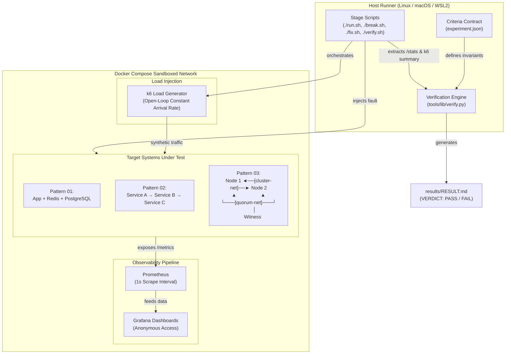

# IncidentLab

**Break production patterns safely. Fix them. Prove the recovery.**

[](https://github.com/SreeNaresh1/ai-developer-toolkit/actions/workflows/e2e.yml)
[](https://docs.docker.com/compose/)
[](https://grafana.com/)
[](https://k6.io/)

```text
BREAK IT ──► WATCH IT FAIL ──► UNDERSTAND WHY ──► APPLY THE FIX ──► WATCH IT RECOVER ──► PROVE IT
```

IncidentLab is a curated laboratory of runnable, locally reproducible distributed-systems failure patterns. Rather than reading postmortems or abstract descriptions, each lab boots a real, minimal multi-container topology in Docker Compose, injects a canonical architectural fault, captures the live degradation on Grafana dashboards, applies production-grade mitigation, and mathematically verifies recovery against explicit invariant assertions.

---

## Pattern Catalog & Verification Status

Every pattern has been validated through real Docker execution and verified in GitHub Actions CI:

| # | Pattern | Category | Topology | Failure Signature | Mitigation Technique | Local Run | CI Status |
|---|---|---|---|---|---|---|---|
| **01** | [**Thundering Herd**](patterns/01-thundering-herd/README.md) | Cache / Contention | FastAPI + Redis + PostgreSQL | Cache stampede, DB connection exhaustion, P99 explosion | Singleflight (mutex-collapsed origin fetching) | ✅ PASS | [](https://github.com/SreeNaresh1/ai-developer-toolkit/actions) |
| **02** | [**Cascading Retry Storm**](patterns/02-cascading-retry-storm/README.md) | Queuing / Resilience | 3-Tier Microservices (A → B → C) | Retry amplification (13,000+ retries), queue explosion, 0% availability | Circuit Breaker + Exp. Backoff with Full Jitter | ✅ PASS | [](https://github.com/SreeNaresh1/ai-developer-toolkit/actions) |
| **03** | [**Split-Brain**](patterns/03-split-brain/README.md) | Consensus / Partitioning | 2 KV Nodes + Quorum Witness | Network partition causes dual-leader conflict, 20 divergent keys | Witness Quorum Lease + Epoch Fencing Token | ✅ PASS | [](https://github.com/SreeNaresh1/ai-developer-toolkit/actions) |

---

## System Architecture

IncidentLab isolates orchestration, traffic generation, failure injection, live telemetry, and verification into a modular, repeatable test harness:



---

## The Standard Experiment Lifecycle

Every pattern follows an immutable, 5-stage lifecycle. No stage is simulated via mock flags — network disconnections use real Docker bridge network severed states, queue saturation uses real bounded worker semaphores, and database connection exhaustion uses real PostgreSQL connection pools:

```text
┌──────────────┐   ┌──────────────┐   ┌──────────────┐   ┌──────────────┐   ┌──────────────┐
│  1. BASELINE │ ─►│   2. BREAK   │ ─►│  3. OBSERVE  │ ─►│   4. FIX     │ ─►│  5. VERIFY   │
└──────────────┘   └──────────────┘   └──────────────┘   └──────────────┘   └──────────────┘
    ./run.sh           ./break.sh     (Grafana/Prometheus)   ./fix.sh          ./verify.sh
```

### Stage 1: BASELINE (`./run.sh`)
- **Action**: Brings up a clean stack via `docker compose down -v` followed by `docker compose up -d --build`.
- **Precondition Check**: Validates that all services are healthy and that zero residual state or divergence exists.
- **Load Execution**: Runs realistic, open-loop baseline traffic via k6 to measure healthy P99 latency, zero-error rates, and baseline resource utilization.
- **Snapshot**: Captures post-load telemetry to `results/baseline_stats.json` and `results/baseline_k6.json`.

### Stage 2: BREAK (`./break.sh`)
- **Action**: Injects the canonical failure trigger (e.g. severing Docker networks, flushing cache under high concurrency, or artificially delaying downstream dependencies).
- **Failure Load**: Replays high-intensity or open-loop load against the degraded architecture.
- **Snapshot**: Captures the failure state to `results/break_stats.json` and `results/break_k6.json`. Leaves the system broken so it can be observed live.

### Stage 3: OBSERVE
- **Action**: Inspect the failure live in Grafana (ports `3000`, `3001`, or `3002`).
- **Signature Detection**: Watch queue depths spike, leader gauges register split-brain, or database connection pools saturate.

### Stage 4: FIX (`./fix.sh`)
- **Action**: Applies the architectural mitigation (e.g. atomic witness lease claims, singleflight query collapsing, or circuit breaker tripped states).
- **Data Reconciliation**: Reconciles or safely discards corrupted or uncoordinated data left behind by BREAK.
- **Mitigated Load**: Replays the identical failure-inducing load test while the underlying degradation or network partition is still present.
- **Healing**: Restores networks, resets connection pools, and verifies stability.

### Stage 5: VERIFY (`./verify.sh`)
- **Action**: Evaluates all collected JSON artifacts against the pattern's declarative [`experiment.json`](schema/pattern.schema.yaml) criteria contract.
- **Three-State Verdict**:
  - **`PASS`**: Both `failure_criteria` (proving the incident actually occurred) AND `recovery_criteria` (proving the fix actually mitigated it) passed.
  - **`FAIL`**: The incident occurred, but the mitigation failed to recover the system to required thresholds.
  - **`INVALID`**: The incident was never successfully reproduced during BREAK, meaning any subsequent "recovery" is scientifically meaningless.
- **Artifact**: Writes the formal, human-readable audit record to `results/RESULT.md`.

---

## Pattern Comparison Matrix

| Metric / Dimension | Pattern 01: Thundering Herd | Pattern 02: Cascading Retry Storm | Pattern 03: Split-Brain |
|---|---|---|---|
| **Root Cause** | Cache entry eviction under high concurrency | Downstream latency spike + uncoordinated client retries | Network partition between peer nodes |
| **Topology** | 1 App, 1 Redis, 1 PostgreSQL | 3 Microservices (Gateway → Checkout → Payment) | 2 Clustered KV Nodes, 1 Quorum Witness |
| **Trigger Mechanism** | Cache key expired while 300 VUs read key | Service C slows (50ms → 90ms), exceeding 100 RPS capacity | Docker disconnects peer network (`cluster-net`) |
| **Failure Symptoms** | 300 concurrent DB queries; pool exhausted; P99 latency spikes | Retries surge (13,000+ attempts); 1,760x queue explosion; 0% availability | Both nodes claim `is_leader=True`; 20 divergent keys written |
| **Mitigation Applied** | Singleflight mutex locks (1 query per key, others await) | Circuit Breaker (fail-fast) + Exponential Backoff with Jitter | Witness Quorum Lease (TTL 2s) + Epoch Write Fencing |
| **Baseline Latency (P99)** | **2 ms** (100% cache hits) | **57 ms** (healthy downstream) | **2 ms** (single leader) |
| **Break Latency (P99)** | **Spikes to 1500+ ms** | **Spikes to 560+ ms** (cascading timeout) | **1–2 ms** (both accept, but corrupt) |
| **Fix Latency (P99)** | **Recovered (< 25 ms)** | **Controlled (< 120 ms)** | **2 ms** (clean single leader) |
| **Key Invariant** | `origin_fetches_max <= 2` | `c_requests_outstanding_max <= 16` | `divergent_keys == 0` |
| **Verified Result** | **VERDICT: PASS (6/6 checks)** | **VERDICT: PASS (8/8 checks)** | **VERDICT: PASS (7/7 checks)** |

---

## CLI & Docker Usage

### System Requirements
- **OS**: Linux, macOS, or Windows via WSL2 / Git Bash (the runner scripts use standard POSIX bash).
- **Container Engine**: Docker Desktop or Docker Engine with Docker Compose v2 (`docker compose version`).
- **Host Tools**: `bash`, `curl`, and `python3` (3.10+, standard library only — zero pip dependencies required on the host).
- **Memory**: ~2 GB free RAM per running pattern.

### Port Map
Each pattern binds exclusively to `127.0.0.1` on unique port ranges, allowing labs to run side-by-side without port collisions:

| Pattern | Service / Node Ports | Prometheus Port | Grafana Port | Anonymous Login |
|---|---|---|---|---|
| **01 — Thundering Herd** | App: `8000`, Postgres: `5432`, Redis: `6379` | `9090` | `http://localhost:3000` | Enabled (Viewer) |
| **02 — Retry Storm** | Service A: `8010`, Service B: `8011`, Service C: `8012` | `9091` | `http://localhost:3001` | Enabled (Viewer) |
| **03 — Split-Brain** | Node 1: `8020`, Node 2: `8021`, Witness: `8022` | `9092` | `http://localhost:3002` | Enabled (Viewer) |

### Quickstart: Running a Lab

```bash
# Navigate to the desired pattern directory
cd patterns/03-split-brain

# 1. Bring up the stack and establish baseline telemetry
./run.sh

# 2. Inject the architectural failure and observe
./break.sh

# 3. Apply the mitigation, reconcile data, and re-test
./fix.sh

# 4. Mathematically verify reproduction and recovery
./verify.sh

# 5. Inspect the generated report
cat results/RESULT.md
```

### Clean Teardown
To completely tear down a pattern, clean volumes, and remove orphaned networks:
```bash
docker compose down -v --remove-orphans
```

### Static Schema & Metric Checks
To validate that all pattern definitions, Prometheus counters, and criteria schemas remain strictly aligned across the repository:
```bash
python3 tools/lib/static_check.py
```

---

## Observability & Live Dashboards

Every pattern automatically configures pre-provisioned Grafana dashboards and Prometheus scrapers on startup:

### Pattern 01: Thundering Herd Dashboard (`http://localhost:3000`)
- **Cache Hit vs Miss Ratio**: Drops from 100% to near 0% during stampede, then recovers to 99% under singleflight.
- **Concurrent DB Origin Queries**: Spikes to match incoming concurrency in BREAK; clamped to 1 in FIX.
- **Request Latency Distribution (P50 / P95 / P99)**: Shows immediate elimination of DB connection queueing.

### Pattern 02: Cascading Retry Storm Dashboard (`http://localhost:3001`)
- **Queue Depth at Service C**: Jumps from 0 to 1,760+ in BREAK; clamped below 16 in FIX by the circuit breaker.
- **Retry Multiplier**: Visualizes amplification factor (up to 4x traffic generated per incoming request).
- **Circuit Breaker State**: Shows state transitions (`CLOSED` → `OPEN` → `HALF-OPEN`).

### Pattern 03: Split-Brain Dashboard (`http://localhost:3002`)
- **Leader Status**: Real-time gauge showing whether both nodes claim `is_leader=1` simultaneously.
- **Writes Accepted / Rejected Rate**: Shows conflicting writes accepted across both nodes during partition, and follower rejection (503) under witness fencing.
- **Witness Lease Expiry & Fencing Epoch**: Tracks monotonic epoch increments confirming write admission.

---

## Technical Demo (2-3 Minutes)

Need to present or demo IncidentLab? We provide an exact, time-coded speaker walkthrough script in [`DEMO.md`](DEMO.md):
- **0:00 – 0:30**: Introduction & The IncidentLab Philosophy
- **0:30 – 1:00**: Baseline execution & healthy invariant confirmation
- **1:00 – 1:40**: Network partition injection & live split-brain demonstration
- **1:40 – 2:20**: Witness quorum fencing & epoch data reconciliation
- **2:20 – 3:00**: Automated verification audit & CI confirmation

See [`DEMO.md`](DEMO.md) for the full transcript and pre-flight checklist.

---

## Pattern 04 Evaluation Framework

IncidentLab prioritizes architectural depth and distinct failure modes over raw count. Before adding a fourth pattern, candidate incidents are evaluated against strict qualification criteria:

### Qualification Criteria
1. **Distinct Failure Domain**: Must not duplicate caching (P01), queueing/retries (P02), or network partitioning (P03).
2. **Deterministic Reproduction**: Must be 100% reproducible in Docker Compose without probabilistic flaky sleeps.
3. **Architectural Mitigation**: The fix must be a recognized distributed pattern (not a simple config tweak like bumping a timeout).
4. **Independent Measurability**: The failure and recovery must be verifiable through explicit Prometheus counters and client-side metrics.

### Candidate Analysis
- **Candidate A: Distributed Deadlock / Lock Inversion** (Locking / Concurrency)
  - *Mechanism*: Two services acquire distributed locks across multiple resources in inverted order under concurrent load.
  - *Mitigation*: Global lock ordering or deadlock detection with randomized backoff release.
- **Candidate B: Unbounded In-Memory Queue / Slow Consumer (OOM Collapse)** (Resource Depletion)
  - *Mechanism*: Backpressure failure where an upstream publisher overwhelms a slow consumer, exhausting container cgroup memory and triggering Docker OOM killer.
  - *Mitigation*: Reactive streams backpressure / bounded drop-head queueing with reject status.
- **Candidate C: Clock Skew / Lease Invalidation** (Time & Distributed Coordination)
  - *Mechanism*: Simulated NTP drift or clock jump causing a leader to believe its lease is valid after the cluster has already re-elected a successor.
  - *Mitigation*: TrueTime-style error bounds or monotonic physical-logical hybrid clocks (HLC).

*Current recommendation: Pattern 01, 02, and 03 form a complete, production-grade core suite. Candidate B (Backpressure & OOM Collapse) is the leading design candidate for the next phase of development.*

---

## License

MIT © [Sree Naresh A](https://github.com/SreeNaresh1)
